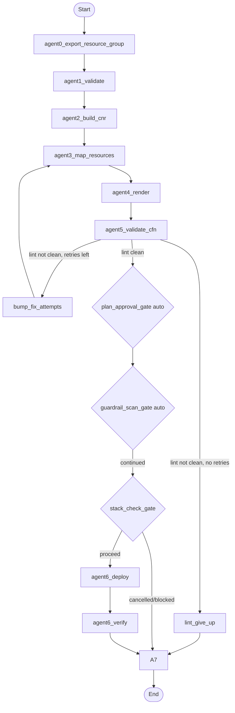

# Agentic Workflow: Azure Bicep -> AWS CloudFormation

This document explains the complete agentic workflow used by this project:
1. what each agent receives as input,
2. how each agent processes that input,
3. what output each agent produces, and
4. why that step is important.

It reflects the implemented LangGraph flow in `orchestrator/graph.py` and the node logic in `orchestrator/agents.py`.

## Why this workflow matters

The workflow is intentionally split into deterministic stages + one LLM reasoning stage + a single interactive stack gate.

This gives you:
- Better control and auditability (every step writes structured state and artifacts).
- Safer deployments (automatic plan/guardrail checkpoints plus stack conflict gate).
- Better quality output (cfn-lint retry loop feeds failures back to Agent 3 for correction).
- Lower risk than direct "Bicep -> CloudFormation in one LLM call".

## End-to-end flow

## Workflow input at run start

Initial state is created in `migrate_agents.py`.

Primary startup inputs:
- `bicep_path` or `resource_group` (exactly one mode)
- `dry_run`
- `output_dir`
- `run_id`
- `max_fix_attempts`
- `param_overrides` (from `--params-file`)

Global config (from environment via `Config.from_env()`):
- AWS region and model settings
- RAG settings
- Guardrail scan enabled/disabled
- Azure resource-group export settings

## Agent-by-agent contract

### Agent 0: `agent0_export_resource_group` (optional path)

Input:
- `resource_group`, `subscription_id` (only when resource-group mode is used)

Process:
- Exports the full Azure resource group into source template JSON.
- Attempts to fetch source Key Vault secret values for later parameter carry-over.

Output:
- `bicep_path` (path to exported source JSON)
- `source_secret_values`
- `source_vault_names`
- `agent_log`

Why important:
- Enables migration directly from a live Azure resource group.
- Captures source secret context so deployment parameters can be resolved without manual copy/paste.

### Agent 1: `agent1_validate`

Input:
- `bicep_path`
- Knowledge base supported resource type list

Process:
- Compiles/loads source into ARM JSON.
- Extracts resource types.
- Separates supported, unsupported, implicit-default no-op child types, and foldable child types.
- If unsupported types are found, asks whether to continue with supported types only.

Output:
- `arm_template`
- `resource_types`
- `unsupported_types`
- `noop_types`
- `foldable_types`
- `stopped`, `stop_reason` (if halted)
- `agent_log`

Why important:
- Prevents blind migration of unmapped resource types.
- Makes unsupported scope explicit before spending LLM/deploy effort.

### Agent 2: `agent2_build_cnr`

Input:
- `arm_template`
- `resource_types`
- `foldable_types`

Process:
- Builds cloud-neutral representation (CNR).
- Folds child-resource properties into parent where required.
- Writes CNR artifact to run folder.

Output:
- `cnr`
- `per_resource_templates`
- `agent_log`

Why important:
- Normalizes source shape into a stable, provider-neutral structure.
- Reduces prompt complexity and improves mapping consistency for the LLM.

### Agent 3: `agent3_map_resources`

Input:
- `cnr`, `resource_types`
- RAG-retrieved mapping docs (or full docs fallback)
- On retries: `lint_output`, `migration_plan_raw`, `fix_attempts`

Process:
- Builds migration prompt from CNR + mapping context.
- Calls generator (Bedrock).
- Parses and validates structured migration-plan JSON.
- On retry path, asks for corrected plan using lint feedback.

Output:
- `migration_plan_raw`
- `migration_plan`
- `mapping_table`
- `stopped`, `stop_reason` (if parsing fails)
- `agent_log`

Why important:
- This is the core reasoning step: Azure intent -> AWS design mapping.
- Keeps output structured (plan JSON), not free-form template text.

### Gate: `plan_approval_gate` (automatic checkpoint)

Input:
- `migration_plan`
- `fix_attempts`, lint context

Process:
- Displays plan summary (resources, parameters, conditions, outputs).
- Runs only after `agent5_validate_cfn` reports a clean lint result (0 errors, 0 warnings).
- Auto-approves in non-interactive mode.

Output:
- `plan_confirmed`
- `agent_log`

Why important:
- Logged review checkpoint before deployment can proceed.
- Prevents auto-propagating an incorrect architecture decision.

### Agent 4: `agent4_render`

Input:
- `migration_plan`
- `bicep_path`, `output_dir`

Process:
- Deterministically renders CloudFormation YAML from migration plan.
- Writes output template file.

Output:
- `cfn_yaml`
- `output_path`
- `agent_log`

Why important:
- Keeps syntax generation deterministic and testable.
- Separates reasoning concerns from template rendering concerns.

### Agent 5: `agent5_validate_cfn`

Input:
- `output_path` (rendered template)

Process:
- Runs cfn-lint.
- Counts errors/warnings.
- Treats any warning as not-clean (same as errors) for retry purposes.
- Appends attempt history and writes detailed validation report.

Output:
- `lint_passed`
- `lint_output`
- `lint_errors`, `lint_warnings`
- `validation_history`
- `agent_log`

Why important:
- Structural safety check before any AWS mutation.
- Drives self-correction loop by feeding lint failures back to Agent 3.

### Control node: `bump_fix_attempts`

Input:
- `fix_attempts`

Process:
- Increments retry counter.

Output:
- updated `fix_attempts`

Why important:
- Enforces bounded correction loop and avoids infinite retries.

### Control node: `lint_give_up`

Input:
- `fix_attempts`, `max_fix_attempts`

Process:
- Stops run after retries are exhausted.

Output:
- `stopped=True`
- `stop_reason`
- `agent_log`

Why important:
- Fails safely when template quality cannot be recovered automatically.

### Gate: `guardrail_scan_gate`

Input:
- `output_path`, `cfn_yaml`

Process:
- Runs security scanning with Checkov + custom checks.
- Reports findings (including HIGH/CRITICAL) and auto-continues in non-interactive mode.
- Writes guardrail report artifact.

Output:
- `guardrail_findings`
- `guardrail_report_path`
- `agent_log`

Why important:
- Adds security risk gate after correctness linting and before deployment.
- Surfaces high-severity security misconfigurations clearly in artifacts and logs.

### Gate: `stack_check_gate`

Input:
- target stack name derived from `bicep_path`

Process:
- Checks whether stack exists and current status.
- Handles blocked statuses (delete/recreate prompt).
- For existing stack, asks delete/recreate vs cancel.

Output:
- `stack_action` (`create`)
- `human_decisions` (if prompted)
- `stopped`, `stop_reason` (if cancelled/blocked)
- `agent_log`

Why important:
- Prevents unsafe or impossible CloudFormation operations.
- Keeps destructive action under explicit human control.

### Agent 6: `agent6_deploy`

Input:
- `migration_plan`, `cfn_yaml`, `stack_action`
- `param_overrides`
- `source_secret_values`, `source_vault_names`

Process:
- Resolves parameter values non-interactively in priority order.
- Validates values against parameter constraints.
- Executes `create_stack` or `update_stack` and waits for completion.

Output:
- `deploy_result`
- `param_values`
- `agent_log`
- `stopped`, `stop_reason` (on unrecoverable parameter/deploy failure)

Why important:
- Performs actual infrastructure mutation in a controlled and reproducible way.
- Avoids interactive prompts that break automation.

### Agent 6b: `agent6_verify`

Input:
- `deploy_result`
- `migration_plan`
- `param_values`

Process:
- Runs post-deploy smoke checks by resource family:
  - Secrets Manager existence
  - VPC default-route reachability
  - Lambda invocation

Output:
- `verify_result`
- `agent_log`

Why important:
- Catches obvious runtime/configuration issues immediately after deploy.
- Improves confidence beyond "stack created successfully".

### Agent 7: `agent7_report`

Input:
- Full accumulated `MigrationState`
- `agent_log`, validation history, guardrail findings, deploy and verify results

Process:
- Writes final run report markdown.
- Logs run outcome to history JSONL.
- Regenerates calibration report.

Output:
- `report_path`
- `agent_log` (final entry)

Why important:
- Produces an auditable artifact of what happened and why.
- Feeds historical metrics for calibration and operational learning.

## Key design principle

Only Agent 3 is LLM-based reasoning.

Everything else is deterministic execution, validation, gating, deployment safety, and reporting.

This architecture is important because it balances:
- flexibility (LLM can reason about mappings), and
- reliability (deterministic rendering + lint + security checkpoints + stack gate + logs).
