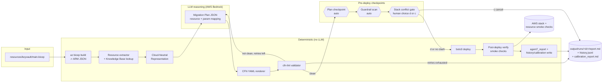
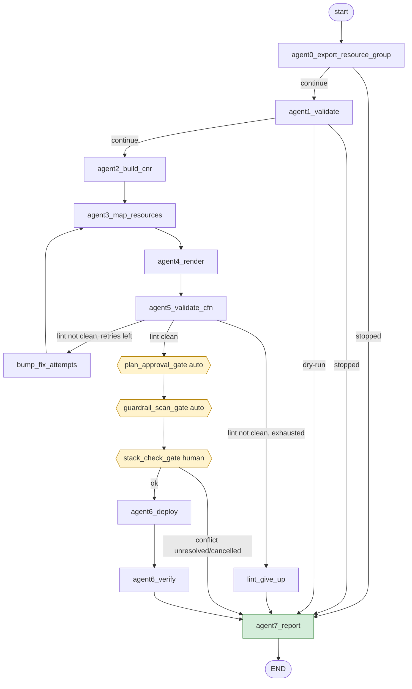

# Azure Bicep → AWS CloudFormation Migration Agent


An agentic pipeline that migrates Azure Bicep infrastructure-as-code to AWS
CloudFormation. A [LangGraph](https://langchain-ai.github.io/langgraph/) state graph of 7
agents wraps deterministic parsing/rendering/validation code around a single LLM reasoning
step (AWS Bedrock). Plan review and guardrail scan are non-interactive checkpoints,
and stack conflict is the only interactive gate before deployment. Deployment itself
(parameter resolution + `create_stack`/`update_stack`) is fully automatic once that
gate passes -- no interactive parameter entry.

> See [CAPSTONE_PLAN.md](CAPSTONE_PLAN.md) for the full target design (guardrails,
> multi-resource knowledge-base growth, evaluation harness). This README describes
> what is **actually implemented today** vs. what's still planned.

## Table of contents
- [Architecture at a glance](#architecture-at-a-glance)
- [Agentic workflow reference](#agentic-workflow-reference)
- [High-level architecture](#high-level-architecture)
- [The LangGraph agent graph](#the-langgraph-agent-graph)
- [Workflows](#workflows)
- [Input modes](#input-modes)
- [Non-interactive parameter resolution](#non-interactive-parameter-resolution)
- [Guardrail security scan](#guardrail-security-scan)
- [Run history & calibration report](#run-history--calibration-report)
- [Project structure](#project-structure)
- [Prerequisites](#prerequisites)
- [Setup](#setup)
- [Steps to run](#steps-to-run)
- [Environment variables](#environment-variables)
- [Resource coverage](#resource-coverage)
- [Knowledge base](#knowledge-base)
- [Tracing & evaluation (optional)](#tracing--evaluation-optional)
- [Evaluation components guide](#evaluation-components-guide)
- [Current progress](#current-progress)
- [Next steps to reach an end-to-end application](#next-steps-to-reach-an-end-to-end-application)
- [Troubleshooting](#troubleshooting)

## Architecture at a glance

```mermaid
flowchart LR
    U([Developer or Operator]) -->|bicep file or\nAzure resource group| CLI[migrate_agents.py\nLangGraph CLI]
    AZ[(Azure Bicep or\nResource Group)] --> CLI

    KB[(Knowledge Base\nAzure to AWS mapping docs)] --> RAG[[RAG retrieval\nvector plus BM25]]
    RAG --> MAP{{Agent 3\nLLM mapping}}

    CLI --> V1[Agent 1 validate]
    V1 --> V2[Agent 2 build CNR]
    V2 --> MAP
    MAP --> RENDER[Agent 4 render CFN]
    RENDER --> LINT[Agent 5 cfn-lint]
    LINT -- lint not clean\nretry left --> MAP

    LINT -- lint clean\n0 errors and 0 warnings --> PLAN{{Plan checkpoint\nauto}}
    PLAN --> GR{{Guardrail scan\nauto}}
    GR --> STACK{{Stack conflict gate\nhuman choice d or c}}
    STACK -- c cancel --> OUT[(output/runs/\nreport.md + history.jsonl + calibration_report.md)]
    STACK -- d or no clash --> DEPLOY[(AWS CloudFormation stack)]
    DEPLOY --> VERIFY[(Post-deploy verification)]
    VERIFY --> OUT

    style MAP fill:#ffe9d6,stroke:#d2691e
    style PLAN fill:#fff3cd,stroke:#b8860b
    style GR fill:#fff3cd,stroke:#b8860b
    style STACK fill:#fff3cd,stroke:#b8860b
    style DEPLOY fill:#d4edda,stroke:#2e7d32
```



Every box above is one of: deterministic Python code (compiling, rendering, linting,
deploying), a single Bedrock LLM call (resource mapping only), or a checkpoint. No
other component makes network calls or mutates AWS state.

## Agentic workflow reference

For a full step-by-step contract of each graph node (input, processing, output, and why it matters), see [AGENTIC_WORKFLOW.md](AGENTIC_WORKFLOW.md).

## High-level architecture

The key design rule: **the LLM only ever reasons and emits a structured JSON "migration
plan" — it never writes CloudFormation syntax directly.** Everything downstream of the LLM
(rendering YAML, linting, deploying) is deterministic code, which keeps the pipeline
auditable and replayable.



## The LangGraph agent graph

`orchestrator/graph.py` wires 7 agents + 3 deployment checkpoints into a single
`StateGraph` (state shape defined in [orchestrator/state.py](orchestrator/state.py)):

| Step | Node | Type | Responsibility |
|---|---|---|---|
| 0 | `agent0_export_resource_group` | deterministic | Optional resource-group export path (when no `bicep_file` is passed): exports the full resource group as ARM JSON to `input/<rg>.json`, and best-effort fetches source Key Vault secret values |
| 1 | `agent1_validate` | deterministic | Compile Bicep → ARM JSON (or load exported ARM JSON), check every resource type has a knowledge-base mapping; auto-continues with supported resources when some are unsupported |
| 2 | `agent2_build_cnr` | deterministic | Build a Cloud-Neutral Representation (CNR) — one language-agnostic template per resource |
| 3 | `agent3_map_resources` | **LLM (Bedrock)** | Map each Azure resource to an AWS equivalent, emit a `MigrationPlan` JSON (resources, params, outputs, conditions) |
| 4 | `agent4_render` | deterministic | Render CloudFormation YAML from the migration plan (no LLM involved) |
| 5 | `agent5_validate_cfn` | deterministic | Run `cfn-lint`; if there are any errors or warnings, loop back to Agent 3 with lint feedback (self-correction), up to `MAX_FIX_ATTEMPTS` |
| — | `plan_approval_gate` | deterministic checkpoint | After a clean `cfn-lint` result (0 errors, 0 warnings), print the plan + mapping table and auto-approve in non-interactive mode |
| — | `guardrail_scan_gate` | deterministic checkpoint | Run `checkov` + custom secret/IAM/network checks (see [Guardrail security scan](#guardrail-security-scan)) against the rendered template; findings are reported and run auto-continues |
| — | `stack_check_gate` | **human gate** | Look up the target CFN stack; if it exists, ask to delete-and-recreate or cancel (auto-detects stuck states like `ROLLBACK_COMPLETE`) |
| 6 | `agent6_deploy` | deterministic | Real `boto3` `create_stack`/`update_stack` -- fully automatic parameter resolution (`--params-file` → `CFN_PARAM_<NAME>` env var → source Key Vault secret/name → template Default) |
| 6b | `agent6_verify` | deterministic | Per-resource-type post-deploy smoke tests: Secrets Manager existence, VPC default-route reachability, and Lambda invoke |
| 7 | `agent7_report` | deterministic | Write `output/runs/<run_id>/report.md` from the full `agent_log`, append the run outcome to `output/runs/history.jsonl`, and regenerate `output/runs/calibration_report.md` (see [Run history & calibration report](#run-history--calibration-report)) |



State flows as a single `MigrationState` `TypedDict`; each agent returns a partial dict
that LangGraph merges in. `agent_log` uses an `operator.add` reducer so every agent's
log entry accumulates instead of overwriting.

## Workflows

### 1. Dry run (no LLM, no AWS calls)
Only Agent 1 runs: compiles the Bicep file and checks knowledge-base coverage, then writes
a report. Useful for quickly validating a new `.bicep` file before spending an LLM call.

```powershell
python migrate_agents.py resources/keyvault/main.bicep --dry-run
```

### 2. Full run (LLM + automatic checkpoints + stack gate + automatic deploy)
Runs the entire graph above. You are prompted only for stack conflicts:
1. **Stack conflict gate** — choose delete-recreate vs. cancel if the target stack
  already exists (only prompts when there's actually a conflict to resolve).

All other checkpoints are non-interactive:
1. **Unsupported resource types** — automatically continue with supported resources only.
2. **Plan approval gate** — runs only after `cfn-lint` is fully clean (0 errors, 0 warnings), then auto-approves in non-interactive mode.
3. **Guardrail scan gate** — logs findings and auto-continues.

Once those pass, **Agent 6 deploys automatically** — no confirmation prompt, no interactive
parameter entry. See [Non-interactive parameter resolution](#non-interactive-parameter-resolution)
for where CFN template parameter values come from.

```powershell
python migrate_agents.py resources/keyvault/main.bicep
```

## Input modes

`migrate_agents.py` supports two input paths:

1. Existing source file mode
   - Pass a `.bicep` file path.
   - Agent 1 compiles it with `az bicep build`.

2. Live Azure resource-group export mode
   - Omit `bicep_file` and set `AZURE_RESOURCE_GROUP` (and optionally `AZURE_SUBSCRIPTION_ID`) in `.env`.
  - Agent 0 runs `az group export` for the full resource group, writes `input/<resource-group>.json`, and the graph continues from that ARM JSON.

Example:

```powershell
# .env contains AZURE_RESOURCE_GROUP=rg-cloud-migration-demo
python migrate_agents.py
```

### 3. Self-correction retry loop
If `cfn-lint` is not clean (any error or warning), the graph loops back to Agent 3 with the
lint output appended to the prompt, asking the LLM for a corrected plan. This repeats up to
`MAX_FIX_ATTEMPTS` (default 2) times before giving up and writing a "stopped" report.

### 4. Legacy linear pipeline (`migrate.py`)
An older, non-agentic version of the same deterministic-render / LLM-reasoning split still
exists (`migrate.py` → `orchestrator/pipeline.py`), kept for backward compatibility. It has
no stack-conflict gate/checkpoint flow and no deploy step -- prefer `migrate_agents.py` for
anything new.


```powershell
python migrate.py resources/keyvault/main.bicep --dry-run
```

## Non-interactive parameter resolution

Agent 6 never prompts for a CFN template parameter value. For each parameter, it resolves a
value in this priority order and fails the run fast (clear error, no silent fallback) if
nothing applies:

1. **`--params-file <path.json>`** — a flat JSON object, e.g. `{"SecretNamePrefix": "myapp/prod"}`.
2. **`CFN_PARAM_<NAME>`** environment variable (e.g. `CFN_PARAM_SECRETNAMEPREFIX`).
3. **Source Key Vault secret** (`NoEcho`/secret parameters only, resource-group export flow
   only) — Agent 0 reads every secret's real value from the source Key Vault's data plane
   (`az keyvault secret show`) and matches it to a parameter by normalized name (e.g.
   `DbPassword` ↔ `db-password`). Requires the `az` CLI identity to hold a data-plane role
   such as **Key Vault Secrets User** on the vault; any fetch failure (e.g. `Forbidden`) is
   logged as a warning by Agent 0, not raised.
4. **Template `Default`** (never used for `NoEcho`/secret parameters, mirroring the old
   interactive behavior).
5. **AWS region-derived fallback for AZ-name params** — for parameters typed as
   `AWS::EC2::AvailabilityZone::Name`, Agent 6 auto-selects the first available AZ in
   `AWS_REGION`.
6. **Source resource group / Key Vault name** — only for non-secret parameters whose name
   looks like a naming/prefix param (contains "prefix" or "namespace", e.g.
   `SecretNamePrefix`) *and* have no `Default`. This is a narrow heuristic; anything else
   unresolved still fails fast rather than guessing.

Every resolved value is still checked against the parameter's own `MinLength`/`MaxLength`/
`AllowedPattern`/`AllowedValues` before `CreateStack`/`UpdateStack`.

Only `stack_check_gate` remains interactive for pre-deploy safety actions. It asks
for delete-recreate vs cancel when the target stack already exists. `plan_approval_gate`
and `guardrail_scan_gate` are non-interactive checkpoints.

## Guardrail security scan

Between `agent5_validate_cfn` (cfn-lint) passing and `stack_check_gate`, `guardrail_scan_gate`
runs static security scanning against the rendered template (`orchestrator/guardrails.py`):

1. **`checkov`** — ~1000 built-in CloudFormation policy checks (encryption at rest, public
   access, logging enabled, etc.). Invoked as `python -m checkov.main` rather than its
   installed console-script wrapper, which fails to resolve its own package on Windows
   (`ModuleNotFoundError: No module named 'checkov'` from the generated `.cmd` shim).
   Open-source checkov checks never carry a real `severity` (that field is populated by the
   paid Bridgecrew platform and is always `null` without an API key), so one is inferred
   from keywords in the check's own description (`public`, `0.0.0.0`, `wildcard`,
   `unencrypted`, etc. → `HIGH`; everything else → `MEDIUM`).
2. **Custom checks**, purpose-built for this project's specific migration risks:
   - **Hardcoded secrets** — a resource property whose name looks like a secret
     (`password`, `secret`, `token`, `apikey`, `connectionstring`, ...) but holds a literal
     string instead of a `Ref`/intrinsic function; or a parameter with a secret-like name
     that has a hardcoded `Default` and is missing `NoEcho: true`.
   - **Overly permissive IAM** — any `Allow` statement (in `AssumeRolePolicyDocument`,
     `PolicyDocument`, or an inline `Policies` entry) with `Action: "*"`, `Resource: "*"`,
     or `Principal: "*"`. `Action: "*"` + `Resource: "*"` together, or a wildcard
     `Principal`, is `CRITICAL`; either alone is `HIGH`.
   - **Open network ingress** — a security group (or standalone ingress rule) open to
     `0.0.0.0/0`/`::/0`. All-ports/all-protocols or a sensitive port (SSH/RDP/common
     database ports) is `CRITICAL`; a wide port range is `HIGH`; anything else is `MEDIUM`.

Findings are always written to the report and shown in the CLI, and the run auto-continues
without a prompt. The full finding list is written to
`output/runs/<run_id>/guardrail_scan_report.txt` and summarized in `report.md`.
Set `GUARDRAIL_SCAN_ENABLED=false` to skip the scan entirely (the gate then auto-continues).

## Run history & calibration report

Every real `migrate_agents.py` run (dry-run or full, completed or stopped) is logged by
`agent7_report` to `output/runs/history.jsonl`, and `output/runs/calibration_report.md` is
regenerated from the full history immediately after (`orchestrator/evaluation.py`). No
opt-in, no LangSmith/network dependency -- distinct from the `evals/` harness below, which
scores synthetic dataset runs; its trimmed eval graph has no `agent7_report` node, so eval
runs never write to `history.jsonl`.

Each JSONL record captures resource types touched, completion status, lint/deploy outcome,
whether the stack-conflict gate was exercised, `fix_attempts`, time-to-migrate, and a
`predicted_success_probability` vs. `actual_outcome` pair used for calibration.
`calibration_report.md` aggregates:

- **Pass rate** -- fraction of runs that completed without stopping.
- **Human-intervention rate** -- fraction of runs where a human had to choose an action
  at the stack-conflict gate.
- **Deploy success rate** -- of runs that reached `agent6_deploy`.
- **Mean/median time-to-migrate**.
- **Brier score** -- calibration of `predict_success_probability()`'s forecast against the
  actual outcome (0 = perfectly calibrated, 0.25 = no better than an uninformative p=0.5
  guess, 1 = perfectly wrong).

```powershell
Get-Content output/runs/calibration_report.md
```

## Project structure

```
.
├── README.md                      # This file
├── CAPSTONE_PLAN.md               # Full target design (guardrails, VPC/Functions, evaluation)
├── migrate_agents.py               # CLI entrypoint — 7-agent LangGraph pipeline (primary)
├── migrate.py                      # CLI entrypoint — legacy linear pipeline (kept for compat)
├── requirements.txt
├── resources/                      # Sample input templates, one folder per resource family
│   ├── keyvault/main.bicep         # Key Vault + 2 secrets
│   ├── vpc/main.bicep              # VNet + subnet sample input
│   ├── functions/main.bicep        # Function App sample input
│   ├── storage/main.bicep          # Blob storage account + container sample input
│   ├── messaging/main.bicep        # Storage Queue + Service Bus queue/topic/subscription sample input
│   └── e2e_full_scope/main.bicep   # Mixed-scope sample used for broader E2E exercises
├── knowledge_base/
│   ├── index.json                  # ARM resource type -> mapping doc path
│   ├── bicep-to-cloudformation.md  # Human-authored Key Vault -> Secrets Manager mapping doc
│   ├── vpc-to-cloudformation.md    # VNet/Subnet/NSG/Route Table/NAT Gateway -> VPC mapping doc
│   ├── functions-to-cloudformation.md  # Function App + triggers + packaging -> Lambda/IAM/S3 mapping doc
│   ├── storage-to-cloudformation.md    # Blob container -> S3 bucket mapping doc
│   └── messaging-to-cloudformation.md  # Storage Queue + Service Bus queue/topic -> SQS/SNS mapping doc
├── orchestrator/
│   ├── state.py                   # MigrationState TypedDict (shared graph state)
│   ├── agents.py                  # agent1..agent7 + plan_approval_gate/guardrail_scan_gate/stack_check_gate
│   ├── guardrails.py               # checkov + custom secret/IAM/network checks (guardrail_scan_gate)
│   ├── graph.py                   # build_graph() — StateGraph wiring, routing, retry loop
│   ├── bicep_compiler.py          # az bicep build -> ARM JSON
│   ├── resource_extractor.py      # Walk ARM JSON, collect resource types
│   ├── knowledge_base.py          # Load index.json, map types -> docs
│   ├── cloud_neutral.py           # Build the Cloud-Neutral Representation (CNR)
│   ├── migration_plan.py          # MigrationPlan dataclass, JSON schema hint, parsing/validation
│   ├── generator.py               # Generator ABC + BedrockGenerator (pluggable LLM backend)
│   ├── rag.py                     # Retrieval over knowledge_base/ docs (vector + BM25 hybrid)
│   ├── cfn_generator.py           # Deterministic MigrationPlan -> CloudFormation YAML
│   ├── validator.py               # cfn-lint integration
│   ├── azure_export.py            # az group export (ARM JSON) + source Key Vault secret fetch
│   ├── config.py                  # Env-var driven Config (region, model id, retry limit)
│   ├── observability.py           # LangSmith tracing + secret redaction (opt-in)
│   ├── secrets_handling.py        # SecretValue wrapper + root logging redaction filter
│   ├── evaluation.py              # Eval-harness targets/evaluators (see evals/) + run-history/calibration report
│   ├── cli_ui.py                  # Shared Rich console helpers for all CLI entrypoints
│   ├── prompts/                   # Versioned Agent 3 system prompts (agent3_v1, agent3_v2, ...)
│   └── pipeline.py                # Legacy linear pipeline used by migrate.py
├── evals/                          # Offline/LangSmith evaluation harness (see Tracing & evaluation)
├── scripts/
│   └── create_langsmith_dataset.py # Regenerates evals/datasets/reference/*.json
├── tests/                          # pytest suite (deterministic nodes + evaluators)
└── output/                          # Generated artifacts (gitignored)
    └── runs/
        ├── <run_id>/report.md      # Per-run report written by agent7_report
        ├── history.jsonl           # One JSONL record per real run (see Run history & calibration report)
        └── calibration_report.md  # Pass rate / human-intervention rate / time-to-migrate / Brier score
```

## Prerequisites

- **Python 3.10+** (required by `langgraph`/`langsmith`)
- **Azure CLI 2.90.0+** with the `bicep` extension (`az bicep build` must work)
- **AWS credentials** configured (`aws configure` or environment variables) — required for
  full runs (LLM via Bedrock + real deploy); not needed for `--dry-run`
- **AWS Bedrock access** to the configured model (`bedrock:InvokeModel`)
- **IAM permissions** for CloudFormation (`cloudformation:CreateStack`/`UpdateStack`/
  `DescribeStacks`/`DeleteStack`) and Secrets Manager if verifying deployed secrets

## Setup

```powershell
# 1. Create and activate a virtual environment
python -m venv .venv
.venv\Scripts\activate

# 2. Install dependencies
pip install -r requirements.txt

# 3. Verify Azure CLI + Bicep
az version
az bicep version

# 4. Configure AWS credentials (skip if only running --dry-run)
aws configure
```

## Steps to run

```powershell
# Validate the template + knowledge-base coverage only (no LLM, no AWS)
python migrate_agents.py resources/keyvault/main.bicep --dry-run

# Full migration: LLM plan -> render -> lint/retry -> auto checkpoints -> stack gate (if clash) -> deploy
python migrate_agents.py resources/keyvault/main.bicep

# Custom output directory / knowledge-base index
python migrate_agents.py resources/keyvault/main.bicep --output-dir output --kb-index knowledge_base/index.json
```

Every run writes `output/runs/<run_id>/report.md` summarizing the agent log, resource
mapping table, and final status (completed / stopped + reason).

## Quick start by scenario

### 1) Key Vault -> Secrets Manager (local Bicep input)

```powershell
# Dry run only
python migrate_agents.py resources/keyvault/main.bicep --dry-run

# Full migration
python migrate_agents.py resources/keyvault/main.bicep
```

### 2) VNet -> VPC/Subnet (local Bicep input)

```powershell
# Validate coverage and parsing
python migrate_agents.py resources/vpc/main.bicep --dry-run

# Full migration and deploy
python migrate_agents.py resources/vpc/main.bicep
```

### 3) Function App baseline -> Lambda (local Bicep input)

```powershell
# Validate coverage and parsing
python migrate_agents.py resources/functions/main.bicep --dry-run

# Full migration and deploy
python migrate_agents.py resources/functions/main.bicep
```

### 4) Live resource-group export mode (no bicep_file argument)

```powershell
# .env should define AZURE_RESOURCE_GROUP (and optionally AZURE_SUBSCRIPTION_ID)
python migrate_agents.py
```

### 5) Pass required CloudFormation parameters non-interactively

```powershell
# Option A: parameters file
python migrate_agents.py resources/vpc/main.bicep --params-file .\input\params.json

# Option B: environment variable per parameter
$env:CFN_PARAM_AVAILABILITYZONE = "us-east-1a"
python migrate_agents.py resources/vpc/main.bicep
```

## Environment variables

| Variable | Default | Purpose |
|---|---|---|
| `AWS_REGION` | `us-east-1` | Region for Bedrock + CloudFormation calls |
| `BEDROCK_MODEL_ID` | `amazon.nova-pro-v1:0` | Bedrock model used by Agent 3 |
| `BEDROCK_EMBEDDING_MODEL_ID` | `amazon.titan-embed-text-v2:0` | Bedrock embedding model used by RAG retrieval |
| `MAX_FIX_ATTEMPTS` | `2` | Self-correction retries on `cfn-lint` failure before giving up |
| `GUARDRAIL_SCAN_ENABLED` | `true` | Run `checkov` + custom secret/IAM/network checks on the rendered template before deployment (see [Guardrail security scan](#guardrail-security-scan)) |
| `RAG_ENABLED` | `true` | Enable retrieval over `knowledge_base/` docs for Agent 3 prompt context |
| `RAG_TOP_K` | `4` | Number of retrieved chunks per mapping doc when RAG is enabled |
| `RAG_HYBRID_SEARCH` | `true` | Fuse vector (Bedrock embedding) search with BM25 keyword search (Reciprocal Rank Fusion); falls back to vector-only automatically if `rank_bm25` is unavailable |
| `AZURE_RESOURCE_GROUP` | — | Optional: source resource group for Agent 0 export mode (when no `bicep_file` arg is passed) |
| `AZURE_SUBSCRIPTION_ID` | — | Optional subscription for Agent 0 export/list operations |
| `CFN_PARAM_<NAME>` | — | Non-interactive value for CFN template parameter `<NAME>` (see [Non-interactive parameter resolution](#non-interactive-parameter-resolution)) |
| `LANGSMITH_TRACING` | `false` | Opt-in LangSmith tracing of the migration graph; off means zero LangSmith imports/network calls |
| `LANGSMITH_API_KEY` | — | LangSmith API key; tracing stays off without it even if `LANGSMITH_TRACING=true` |
| `LANGSMITH_PROJECT` | `bicep-to-cfn-migration` | LangSmith project name traces are written to |
| `LANGSMITH_ENDPOINT` | — | Optional custom LangSmith API endpoint (self-hosted/EU, etc.) |
| `PROMPT_SOURCE` | `local` | `local` (byte-stable text in `orchestrator/prompts/agent3_v1`) or `hub` (best-effort `langsmith` Hub pull, always falls back to `local` on any failure) |

## Resource coverage

Current knowledge-base mappings in `knowledge_base/index.json`:

- Key Vault: `Microsoft.KeyVault/vaults`, `Microsoft.KeyVault/vaults/secrets`
- VNet: `Microsoft.Network/virtualNetworks`, `Microsoft.Network/virtualNetworks/subnets`, plus
  NSGs (`Microsoft.Network/networkSecurityGroups[/securityRules]`), route tables
  (`Microsoft.Network/routeTables[/routes]`), NAT gateways (`Microsoft.Network/natGateways`)
  and `Microsoft.Network/publicIPAddresses`
- Functions baseline: `Microsoft.Web/sites`, `Microsoft.Web/serverfarms`, `Microsoft.Storage/storageAccounts`
  (deployment-bucket dependency), plus trigger-type and packaging-workflow guidance
- Blob Storage: `Microsoft.Storage/storageAccounts/blobServices/containers` (standalone
  application blob data -> S3 buckets, distinct from the Functions deployment-bucket use above)
- Messaging/Eventing: `Microsoft.Storage/storageAccounts/queueServices/queues`,
  `Microsoft.ServiceBus/namespaces[/queues|/topics|/topics/subscriptions]`
  (Storage Queue/Service Bus -> SQS/SNS, aligned with Function-trigger migration paths)

Detailed docs:

- `knowledge_base/bicep-to-cloudformation.md` (Key Vault -> Secrets Manager)
- `knowledge_base/vpc-to-cloudformation.md` (VNet/Subnet/NSG/Route Table/NAT Gateway -> VPC/Subnet/Security Group/Route Table/NAT Gateway)
- `knowledge_base/functions-to-cloudformation.md` (Function App baseline + triggers + packaging -> Lambda/IAM/S3)
- `knowledge_base/storage-to-cloudformation.md` (Blob container -> S3 bucket)
- `knowledge_base/messaging-to-cloudformation.md` (Storage Queue + Service Bus queue/topic/subscription -> SQS/SNS)

## Knowledge base

`knowledge_base/index.json` maps an ARM `type` string to a markdown doc documenting the
Azure→AWS mapping (conceptual differences, resource/parameter/property mapping). A resource
type with no entry causes Agent 1 to auto-continue with supported types only (unsupported
types are skipped and logged).

To add a new resource type:
1. Research the Azure resource and its AWS equivalent.
2. Create a markdown doc in `knowledge_base/` following the structure of
   [knowledge_base/bicep-to-cloudformation.md](knowledge_base/bicep-to-cloudformation.md) (concept diff, resource/param/
   property mapping, examples).
3. Add an entry to `knowledge_base/index.json`.

## Tracing & evaluation (optional)

Off by default and fully opt-in -- see [Environment variables](#environment-variables) for
`LANGSMITH_*`. With `LANGSMITH_TRACING=true` and `LANGSMITH_API_KEY` set, every
`migrate_agents.py` run produces one LangSmith trace (per-agent tree, the Bedrock call,
RAG retrieval, retries, gate decisions) with secrets redacted before they ever leave the
process (`orchestrator/observability.py`). Independently of tracing, the runtime now installs
a root logging redaction filter and keeps secret values wrapped as `SecretValue` in state
(`orchestrator/secrets_handling.py`) so accidental plaintext logging is masked. With
LangSmith unset, tracing stays fully off: no imports, no network calls.

Two more pieces build on that for offline-friendly prompt/pipeline evaluation:

- `scripts/create_langsmith_dataset.py` -- (re)generates `evals/datasets/reference/*.json`
  from the seed `.bicep`/ARM sources (deterministic, no LLM/AWS), and optionally pushes them
  to a versioned LangSmith dataset. See [evals/datasets/README.md](evals/datasets/README.md).

  ```powershell
  python scripts/create_langsmith_dataset.py --local-only   # regenerate only, no network
  python scripts/create_langsmith_dataset.py                # also push (skipped without LANGSMITH_API_KEY)
  ```

- `evals/run_eval.py` -- scores Agent 3 (`--target agent3`) or the real Agent 1->5 pipeline
  trajectory (`--target pipeline`, same retry loop, never reaches Agent 6/deploy) against
  that dataset. `--local-only` never touches LangSmith, AWS stack APIs, or a human --
  used by `pytest`.

  ```powershell
  python evals/run_eval.py --target agent3 --local-only --limit 2
  python evals/run_eval.py --target agent3 --dataset bicep-to-cfn-migration-v1 --repetitions 3
  python evals/run_eval.py --target pipeline --dataset bicep-to-cfn-migration-v1 --model-id amazon.nova-lite-v1:0 --no-rag
  ```

  Both modes write `output/evals/<experiment>/{summary.md,results.jsonl}` (pass rate, mean
  score per evaluator, per-example failures).

## Evaluation components guide

For a clear, component-by-component explanation of the evaluation system
(targets, datasets, each evaluator metric, scoring behavior, prompt evaluation,
and run-history calibration), see [EVALUATION_COMPONENTS.md](EVALUATION_COMPONENTS.md).

## Current progress

What's implemented and verified end-to-end (dry-run and full run, including the retry loop
and fully automatic deployment) as of 2026-10-05:

- ✅ 7-agent LangGraph pipeline (`migrate_agents.py`) covering compile → extract → CNR →
  LLM plan → render → lint → self-correction retry → plan approval gate →
  guardrail scan gate → stack conflict gate (when needed) → real `boto3` deploy →
  post-deploy verify → report.
- ✅ Resource-type coverage in the knowledge base includes:
   - Key Vault + secrets (`Microsoft.KeyVault/vaults`, `Microsoft.KeyVault/vaults/secrets`)
  - VNet + subnet (`Microsoft.Network/virtualNetworks`, `.../subnets`) plus NSG/route-table/NAT/public-IP edge mappings
  - Functions baseline (`Microsoft.Web/sites`, `Microsoft.Web/serverfarms`, `Microsoft.Storage/storageAccounts`) plus trigger-behavior and packaging-workflow edge guidance
  - Blob storage containers (`Microsoft.Storage/storageAccounts/blobServices/containers`)
  - Messaging/eventing (`Microsoft.Storage/storageAccounts/queueServices/queues`, `Microsoft.ServiceBus/namespaces[/queues|/topics|/topics/subscriptions]`)
- ✅ End-to-end run artifacts in `output/runs/` include successful VNet migration/deploy
   reports (for example run `481268c5`).
- ✅ Optional Agent 0 resource-group export mode: full resource-group export to ARM JSON
   (`input/<rg>.json`) plus best-effort Key Vault secret carryover.
- ✅ Human-in-the-loop decision point: stack-conflict gate only.
  Other checkpoints (unsupported-type handling, plan checkpoint, and guardrail scan)
  auto-continue in non-interactive mode; deployment itself (parameter resolution +
  create/update-stack) is fully automatic once stack checks pass.
- ✅ Non-interactive CFN parameter resolution: `--params-file` → `CFN_PARAM_<NAME>` env var →
  source Key Vault secret (matched by normalized name, requires `Key Vault Secrets User`-level
  RBAC) → template `Default` → source resource group/vault name (naming/prefix params only).
  Anything still unresolved or invalid fails the run fast instead of blocking on input.
- ✅ Client-side parameter validation (`MinLength`/`MaxLength`/`AllowedPattern`/
  `AllowedValues`) before `CreateStack`/`UpdateStack` to avoid `ROLLBACK_COMPLETE` stacks
  from LLM-generated defaults that violate their own constraints.
- ✅ Stack-state detection (`ROLLBACK_COMPLETE`/`CREATE_FAILED`/`DELETE_FAILED`/
  `*_IN_PROGRESS`) with a human choice to delete-and-recreate, or cancel.
- ✅ Guardrail security scanning (`checkov`) plus custom secret/IAM/network checks on the
  rendered template, with findings reported before deploy (see
  [Guardrail security scan](#guardrail-security-scan)).
- ✅ Structured checkpoint UX: stack conflicts and checkpoint contexts render as rich tables
  with per-gate context snapshots (including run ID + timestamp) instead of raw prompt-style
  input.
- ✅ Automated tests (`pytest`, 71 passing) covering guardrail checks, evaluators, run-history/
  calibration logging, and observability/redaction.
- ✅ `SecretValue` wrapper + root logging redaction filter are in place end-to-end, so
  secrets remain masked in state stringification and accidental log rendering.
- ✅ Legacy non-agentic pipeline (`migrate.py`) retained for backward compatibility.
- ✅ Run-history logging + calibration/Brier-score report (pass rate, human-intervention rate,
  deploy success rate, time-to-migrate) written to `output/runs/history.jsonl` and
  `calibration_report.md` after every real run (see
  [Run history & calibration report](#run-history--calibration-report)).

What's **not** implemented yet (see [CAPSTONE_PLAN.md](CAPSTONE_PLAN.md) for full design):

- ❌ Agent-authored knowledge-base drafting flow (`kb_draft_node`) with enforced human review.

## Next steps to reach an end-to-end application

1. **Coverage expansion cadence**: continue adding one resource family at a time with the same
  pattern used here (mapping doc + index entry + seed sample + eval reference) so each addition
  stays testable and reviewable.
2. **Verification coverage growth**: add more post-deploy smoke tests as new resource
  types are supported (for example: RDS connectivity, API Gateway endpoint health).
3. **CLI packaging**: ship the primary workflow as an installable command (for example via
  `pyproject.toml` + console-script entry point), with ergonomic defaults for local use and
  explicit non-interactive flags for CI automation.

## Troubleshooting

**`az bicep build` not found** — install the Azure CLI and Bicep extension, then verify
with `az bicep version`.

**Bedrock `ResourceNotFoundException` (model not available)** — verify `AWS_REGION`
supports Bedrock and that `BEDROCK_MODEL_ID` is correct and enabled for your account.

**`cfn-lint` errors vs. warnings** — both errors (`E...`) and warnings (`W...`) are treated as
not-clean and trigger the self-correction retry loop; deployment gates run only after
0 errors and 0 warnings.

**Stack stuck in `ROLLBACK_COMPLETE`/`CREATE_FAILED`/`DELETE_FAILED`** — handled
automatically by `stack_check_gate`, which offers to delete-and-recreate the stack.

**`No value available for required parameter '<Name>'`** — Agent 6 couldn't resolve that
CFN parameter non-interactively. Supply it via `--params-file`/`CFN_PARAM_<NAME>` (see
[Non-interactive parameter resolution](#non-interactive-parameter-resolution)); this is
expected for parameters that aren't secrets, don't match a naming/prefix heuristic, and
have no template `Default` — the LLM-generated plan varies run to run. For
`AWS::EC2::AvailabilityZone::Name`, Agent 6 now auto-picks the first available AZ in
`AWS_REGION`.

**Key Vault secret fetch warning (`Forbidden`/`ForbiddenByRbac`)** — the `az` CLI identity
needs a data-plane role on the source vault (it's not enough to have control-plane/ARM
access). Grant it, e.g.:
```powershell
az role assignment create --role "Key Vault Secrets User" --assignee-object-id <your-oid> --assignee-principal-type User --scope <vault-resource-id>
```
Until granted, secret parameters fall through to `--params-file`/`CFN_PARAM_<NAME>` or fail fast.

---

**Status:** Pilot — multi-resource Azure→AWS migration through the 7-agent
graph with automatic plan/guardrail checkpoints, stack-conflict as the only
interactive gate, and fully automatic deployment; see
[Current progress](#current-progress) above for scope.
